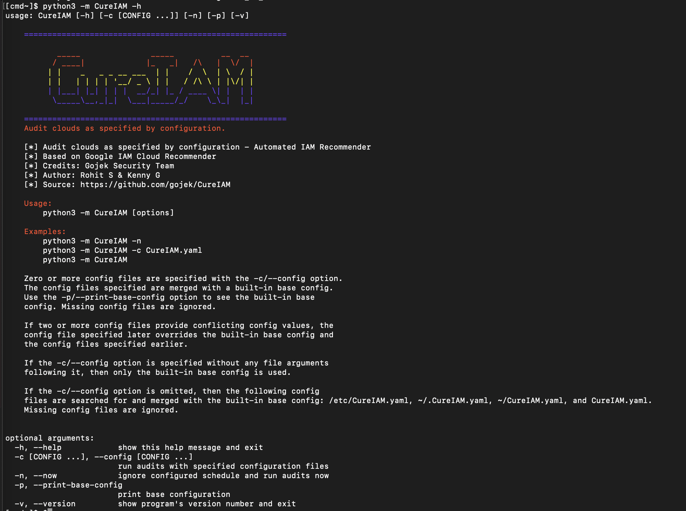

<p align="center">
  
</p>

# CureIAM

<p align="center">
  
</p>

### Clean up of over permissioned IAM accounts on GCP infra in an automated way
CureIAM is an easy-to-use, reliable, and performant engine for Least Privilege Principle Enforcement on GCP cloud infra. It enables DevOps and Security team to quickly clean up accounts in GCP infra that have granted permissions of more than what are required. CureIAM fetches the recommendations and insights from GCP IAM recommender, scores them and enforce those recommendations automatically on daily basic. It takes care of scheduling and all other aspects of running these enforcement jobs at scale. It is built on top of GCP IAM recommender APIs and [Cloudmarker](https://github.com/cloudmarker/cloudmarker) framework.


## Key features
Discover what makes CureIAM scalable and production grade.
- **Config driven** : The entire workflow of CureIAM is config driven. Skip to Config section to know more about it.
- **Scalable** : Its is designed to scale because of its plugin driven, multiprocess and multi-threaded approach.
- **Handles Scheduling**: Scheduling part is embedded in CureIAM code itself, configure the time, and CureIAM will run daily at that time note.
- **Plugin driven**: CureIAM codebase is completely plugin oriented, which means, one can plug and play the existing plugins or create new to add more functionality to it.
- **Track actionable insights**: Every action that CureIAM takes, is recorded for audit purpose, It can do that in file store and in elasticsearch store. If you want you can build other store plugins to push that to other stores for tracking purposes.
- **Scoring and Enforcement**: Every recommendation that is fetch by CureIAM is scored against various parameters, after that couple of scores like `safe_to_apply_score`, `risk_score`, `over_privilege_score`. Each score serves a different purpose. For `safe_to_apply_score` identifies the capability to apply recommendation on automated basis, based on the threshold set in `CureIAM.yaml` config file. 

## Usage
Since CureIAM is built with python, you can run it locally with these commands. Before running make sure to have a configuration file ready in either of `/etc/CureIAM.yaml`, `~/.CureIAM.yaml`, `~/CureIAM.yaml`, or `CureIAM.yaml` and there is Service account JSON file present in current directory with name preferably `cureiamSA.json`. This SA private key can be named anything, but for docker image build, it is preferred to use this name. Make you to reference this file in config for GCP cloud.

```bash
# Install necessary dependencies
$ pip install -r requirements.txt

# Run CureIAM now
$ python -m CureIAM -n

# Run CureIAM process as schedular
$ python -m CureIAM

# Check CureIAM help
$ python -m CureIAM --help
```

CureIAM can be also run inside a docker environment, this is completely optional and can be used for CI/CD with K8s cluster deployment.

```bash
# Build docker image from dockerfile
$ docker build -t cureiam . 

# Run the image, as schedular
$ docker run -d cureiam 

# Run the image now
$ docker run -f cureiam -m cureiam -n 
```

## Config
`CureIAM.yaml` configuration file is the heart of CureIAM engine. Everything that engine does it does it based on the pipeline configured in this config file. Let's break this down in different sections to make this config look simpler.

1. Let's configure first section, which is logging configuration and scheduler configuration.

  ```yaml
    logger:
      version: 1

      disable_existing_loggers: false

      formatters:
        verysimple:
          format: >-
              [%(process)s]
              %(name)s:%(lineno)d - %(message)s
          datefmt: "%Y-%m-%d %H:%M:%S"

      handlers:
        rich_console:
          class: rich.logging.RichHandler
          formatter: verysimple

        file:
          class: logging.handlers.TimedRotatingFileHandler
          formatter: simple
          filename: /tmp/CureIAM.log
          when: midnight
          encoding: utf8
          backupCount: 5

      loggers:
        adal-python:
          level: INFO

      root:
        level: INFO
        handlers:
          - rich_console
          - file

    schedule: "16:00"
  ```
  This subsection of config uses, `Rich` logging module and schedules CureIAM to run daily at `16:00`.

2. Next section is configure different modules, which we MIGHT use in pipeline. This falls under `plugins` section in `CureIAM.yaml`. You can think of this section as declaration for different plugins.
  ```yaml
    plugins:
      gcpCloud:
        plugin: CureIAM.plugins.gcp.gcpcloud.GCPCloudIAMRecommendations
        params:
          key_file_path: cureiamSA.json

      filestore:
        plugin: CureIAM.plugins.files.filestore.FileStore

      gcpIamProcessor:
        plugin: CureIAM.plugins.gcp.gcpcloudiam.GCPIAMRecommendationProcessor
        params:
          mode_scan: true
          mode_enforce: true
          enforcer:
            key_file_path: cureiamSA.json
            allowlist_projects:
              - alpha
            blocklist_projects:
              - beta
            blocklist_accounts:
              - foo@bar.com
            allowlist_account_types:
              - user
              - group
              - serviceAccount
            blocklist_account_types:
              - None
            min_safe_to_apply_score_user: 0
            min_safe_to_apply_score_group: 0
            min_safe_to_apply_score_SA: 50

      esstore:
        plugin: CureIAM.plugins.elastic.esstore.EsStore
        params:
          # Change http to https later if your elastic are using https
          scheme: http
          host: es-host.com
          port: 9200
          index: cureiam-stg
          username: security
          password: securepassword
  ```
  Each of these plugins declaration has to be of this form:
  ```yaml
    plugins:
      <plugin-name>:
        plugin: <class-name-as-python-path>
        params:
          param1: val1
          param2: val2
  ```
  For example, for plugins `CureIAM.stores.esstore.EsStore` which is [this file](./stores/esstore) and class `EsStore`. All the params which are defined in yaml has to match the declaration in `__init__()` function of the same plugin class.

3. Once plugins are defined , next step is to define how to define pipeline for auditing. And it goes like this:
  ```yaml
    audits:
      IAMAudit:
        clouds:
          - gcpCloud
        processors:
          - gcpIamProcessor
        stores:
          - filestore
          - esstore
  ```
  Multiple Audits can be created out of this. The one created here is named `IAMAudit` with three plugins in use, `gcpCloud`, `gcpIamProcessor`, `filestores` and `esstore`. Note these are the same plugin names defined in Step 2. Again this is like defining the pipeline, not actually running it. It will be considered for running with definition in next step.

4. Tell `CureIAM` to run the Audits defined in previous step.
  ```yaml
    run:
      - IAMAudits
  ```
And this makes the entire configuration for CureIAM, you can find the full sample [here](./SampleCureIAM.yaml), this config driven pipeline concept is inherited from [Cloudmarker](https://github.com/cloudmarker/cloudmarker) framework.

## Dashboard
The JSON which is indexed in elasticsearch using Elasticsearch store plugin, can be used to generate dashboard in Kibana. 

## Contribute
[Please do!] We are looking for any kind of contribution to improve CureIAM's core funtionality and documentation. When in doubt, make a PR!

## Credits
Gojek Product Security Team :heart:

## Demo
<<TBA>>

=============
# NEW UPDATES May 2023 0.2.0
## Refactoring
- Breaking down the large code into multiple small function
- Moving all plugins into plugins folder: Esstore, files, Cloud and GCP.
- Adding fixes into zero divide issues
- Migration to new major version of elastic
- Change configuration in CureIAM.yaml file
- Tested in python version 3.9.X

## Library Updates
Adding the version in library to avoid any back compatibility issues.
- Elastic==8.7.0 # previously 7.17.9
- elasticsearch==8.7.0
- google-api-python-client==2.86.0
- PyYAML==6.0
- schedule==1.2.0
- rich==13.3.5

## Docker Files
- Adding Docker Compose for local Elastic and Kibana in elastic
- Adding .env-ex
change .env-ex to .env to before running the docker
```
Running docker compose: docker-compose -f docker_compose_es.yaml up 
```

## Features
- Adding the capability to run scan without applying the recommendation. By default, if mode_scan is false, mode_enforce won't be running.
```
      mode_scan: true
      mode_enforce: false
```
- Turn off the email function temporarily.
